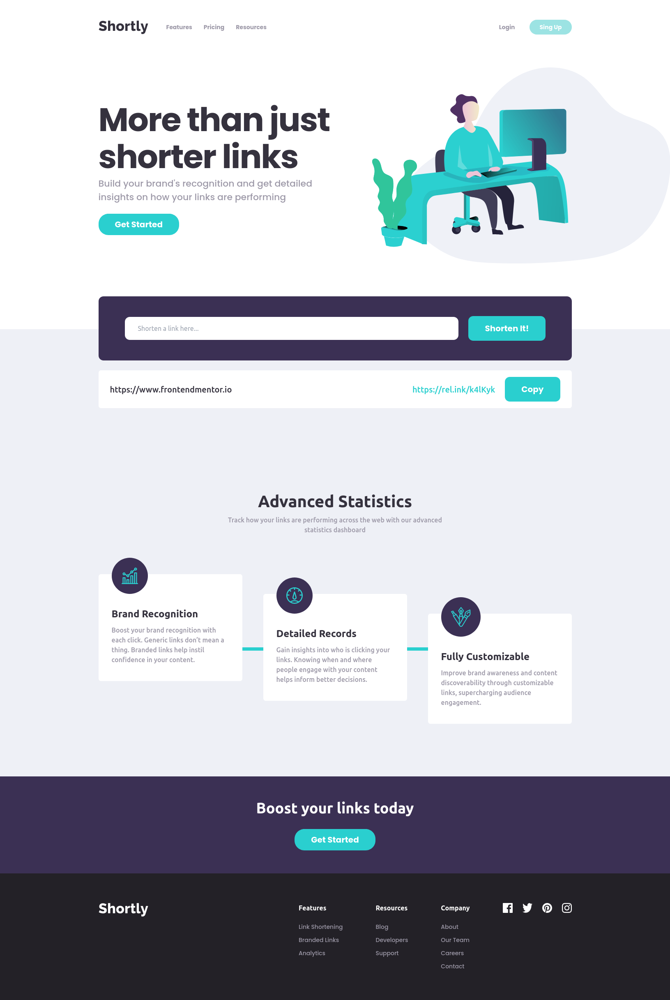

# Frontend Mentor - Shortly URL shortening API Challenge solution

## Welcome! 👋

Thanks for checking out this front-end coding solution.

This is a solution to the [Shortly URL shortening API Challenge challenge on Frontend Mentor](https://www.frontendmentor.io/challenges/url-shortening-api-landing-page-2ce3ob-G). Frontend Mentor challenges help you improve your coding skills by building realistic projects.

## Table of contents

- [Overview](#overview)
  - [The challenge](#the-challenge)
  - [Screenshot](#screenshot)
  - [Links](#links)
- [My process](#my-process)
  - [Built with](#built-with)
- [Author](#author)

## Overview

### The challenge

Users should be able to:

- View the optimal layout for the site depending on their device's screen size
- Shorten any valid URL
- See a list of their shortened links, even after refreshing the browser
- Copy the shortened link to their clipboard in a single click
- Receive an error message when the `form` is submitted if:
  - The `input` field is empty

### Screenshot

### Links

- Solution URL: [Solution URL](https://www.frontendmentor.io/solutions/shortly-url-shortening-api-using-react-EWKMhWUky6)
- Live Site URL: [Live Site URL](https://joaopmazzo.github.io/url-shortening-landing-page/)

## My process

### Built with

- [React](https://reactjs.org/) - JS library
- [Tailwind-css](https://tailwindcss.com/)
- Mobile-first workflow
- Flexbox
- CSS Grid

## Author

- Frontend Mentor - [@joaopmazzo](https://www.frontendmentor.io/profile/joaopmazzo)
- Linked-In - [@joaopmazzo](https://www.linkedin.com/in/joaopmazzo/)

**I hope You all enjoy!** 🚀
